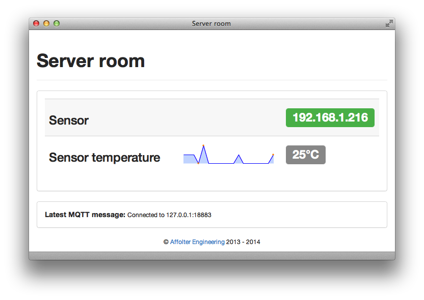

# tempmonitor

A simple web interface which subscribes to an MQTT topic branch to
display the information from a temperature sensor.

The screenshot shows an example:



The sensor is an Arduino which publishes a `1` when it comes online to the topic:

```
clients/arduino/192.168.1.216 1
```

and which otherwise publishes an integer to the

```
clients/arduino/192.168.1.216/celsius 26
```

topic.

The brunt of the work (design, layout, etc.) was stolen from [mqtt-panel](https://github.com/fabaff/mqtt-panel), written by Fabian Affolter.

